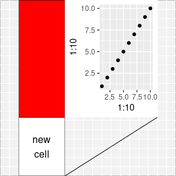
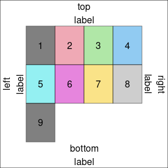
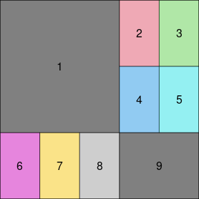

Untitled
================
Baptiste Auguie
2023-01-30

The R package `gtable` is designed to help construct and manipulate
layouts containing graphical elements. The standard `grid` package in R
provides low-level functions to define viewports, and place graphical
elements (grobs) at specific locations within the device window.
`gtable` builds upon these functions and provides a higher-level
interface, where one can e.g. merge two layouts, add columns, rows,
insert graphical elements in a given cell, and change the display order,
among other things.

The `gtable` package is used internally by `ggplot2`, and can therefore
be used to modify the layout of such plots.

### Constructing a gtable

A `gtable` object can be constructed in a variety of ways,

- Empty table

``` r
gtable(unit(1:3, c("cm")), unit(5, "cm"))
```

This is an empty table with 3 rows and one column. `gtable_col` and
`gtable_row` provide a simplified interface for 1 column or 1 row
layouts, respectively.

- matrix layout of grobs

``` r
a <- rectGrob(gp = gpar(fill = "red"))
b <- grobTree(rectGrob(), textGrob("new\ncell"))
c <- ggplotGrob(qplot(1:10,1:10))
```

    ## Warning: `qplot()` was deprecated in ggplot2 3.4.0.

``` r
d <- linesGrob()
mat <- matrix(list(a, b, c, d), nrow = 2)
g <- gtable_matrix(name = "demo", grobs = mat, 
                   widths = unit(c(2, 4), "cm"), 
                   heights = unit(c(2, 5), c("in", "lines")))
g
```

    ## TableGrob (2 x 2) "demo": 4 grobs
    ##   z     cells name                 grob
    ## 1 1 (1-1,1-1) demo    rect[GRID.rect.1]
    ## 2 2 (2-2,1-1) demo  gTree[GRID.gTree.2]
    ## 3 3 (1-1,2-2) demo       gtable[layout]
    ## 4 4 (2-2,2-2) demo lines[GRID.lines.44]

Actual drawing of the gtable on a graphics device is performed with
`grid.draw()`; note that `plot()` is only defined for debugging
purposes, it adds a light grey background and thin grid lines to help
visualise the scene in its drawing context.

``` r
plot(g)
```

<!-- -->

``` r
grid.newpage()
grid.draw(g)
```

<!-- -->

The gridExtra package provides a few conventient constructor functions,
e.g.

- based on `grid.arrange`

``` r
dummy_grob <- function(id)  {
  grobTree(rectGrob(gp=gpar(fill=id, alpha=0.5)), textGrob(id))
}
gs <- lapply(1:9, dummy_grob)
grid.arrange(ncol=4, grobs=gs, 
               top="top\nlabel", bottom="bottom\nlabel", 
               left="left\nlabel", right="right\nlabel")
grid.rect(gp=gpar(fill=NA))
```

<!-- -->

- with a pre-defined layout

``` r
gt <- arrangeGrob(grobs=gs, layout_matrix=rbind(c(1,1,1,2,3),
                                           c(1,1,1,4,5),
                                           c(6,7,8,9,9)))
grid.draw(gt)
grid.rect(gp=gpar(fill=NA))
```

<!-- -->

### Components of a gtable

Let’s have a closer look at the gtable we created earlier.

``` r
print(g)
```

    ## TableGrob (2 x 2) "demo": 4 grobs
    ##   z     cells name                 grob
    ## 1 1 (1-1,1-1) demo    rect[GRID.rect.1]
    ## 2 2 (2-2,1-1) demo  gTree[GRID.gTree.2]
    ## 3 3 (1-1,2-2) demo       gtable[layout]
    ## 4 4 (2-2,2-2) demo lines[GRID.lines.44]

``` r
names(g)
```

    ##  [1] "grobs"         "layout"        "widths"        "heights"      
    ##  [5] "respect"       "rownames"      "colnames"      "name"         
    ##  [9] "gp"            "vp"            "children"      "childrenOrder"

Other useful characteristics of the gtable are,

``` r
length(g); nrow(g); ncol(g)
```

    ## [1] 4

    ## [1] 2

    ## [1] 2

where we note the dual nature of a gtable: it looks like a matrix, in
the sense that it defines a rectangular table of nrow x ncol cells, but
it’s also a *list* with an arbitrary length, defining where and how many
grobs are to be placed in this tabular layout.

The most important components are,

- `grobs`: This is a list of grobs of `length(g)`. Grobs are placed in
  the tabular layout defined by the gtable, and multiple grobs can
  overlap and/or be stacked in the same cell(s).

``` r
length(g$grobs)
```

    ## [1] 4

- `layout`: this is a data.frame indicating the position of each grob.

``` r
g$layout
```

    ##   t l b r z clip name
    ## 1 1 1 1 1 1   on demo
    ## 2 2 1 2 1 2   on demo
    ## 3 1 2 1 2 3   on demo
    ## 4 2 2 2 2 4   on demo

The z-column is used to define the drawing order of the grobs, which
becomes relevant when multiple grobs are stacked on top of each others.
\* `widths` and `heights`: this is the size description of the cells,
given as grid units.

``` r
g$widths; g$heights
```

    ## [1] 2cm 4cm

    ## [1] 2inches 5lines

### Modifying a gtable

The gtable package defines several high-level functions to operate on a
gtable object,

- `t.gtable` to transpose the layout (future versions may support more
  general rotations)

- `[.gtable*`, `gtable_filter`, `gtable_trim` to extract a portion of
  the gtable

- `cbind.gtable*`, `rbind.gtable*` to combine 2 gtable objects
  (particularly useful for aligning multiple ggplots)

- `gtable_add_cols`, `gtable_add_rows`,`gtable_add_col_space`,
  `gtable_add_row_space`, `gtable_add_padding`, `gtable_col_spacer`,
  `gtable_row_spacer`

Manual operations at the low-level on the gtable can involve the grobs
or the layout, but care should be taken to keep the two consistent
(e.g. make sure that the length of both are in sync).

#### Examples to alter ggplot2 plots with gtable

The `gtable` tag on Stack Overlfow has several real-life examples using
gtable to alter a ggplot2 before drawing.

- aligning (multiple) [ggplot objects on a
  device](http://stackoverflow.com/a/17768224/471093), another [use-case
  scenario](http://stackoverflow.com/a/16798372/471093), aligning [base
  plot and ggplot](http://stackoverflow.com/a/14233531/471093)

- adding new grobs [aligned with the plot
  panel](http://stackoverflow.com/a/17371177/471093), also [this
  one](http://stackoverflow.com/a/17493256/471093)

- calculate [the device size based on the plot aspect
  ratio](http://stackoverflow.com/a/16442029/471093)

- add [new axes to a facet_grid
  layout](http://stackoverflow.com/a/17661337/471093), or a [second
  axis](http://stackoverflow.com/a/18511024/471093)
