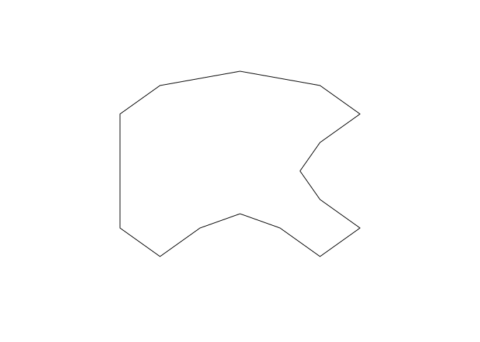
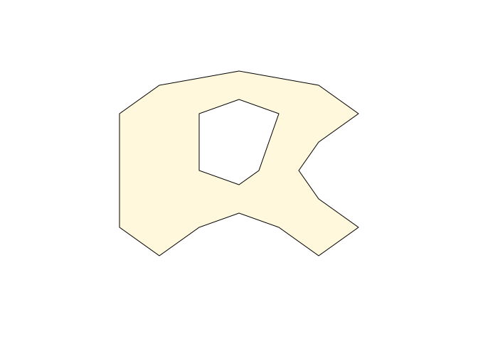
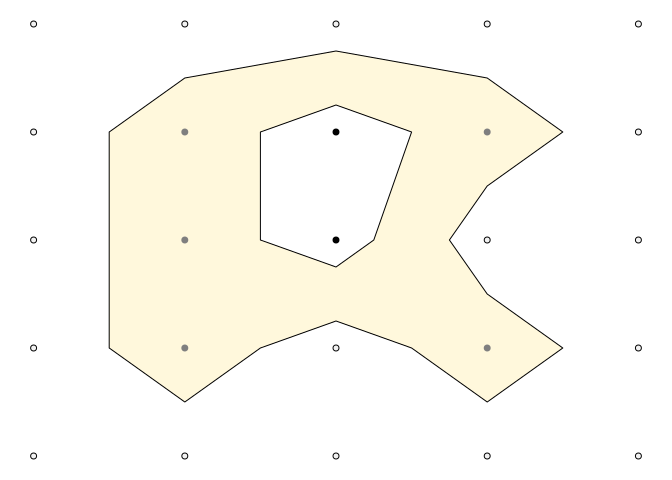
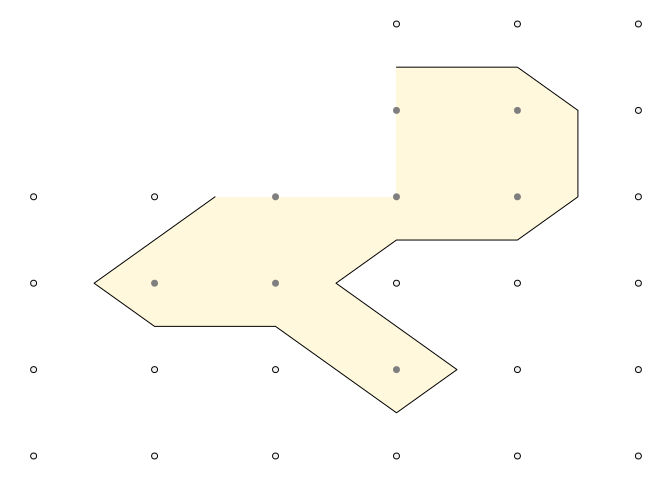
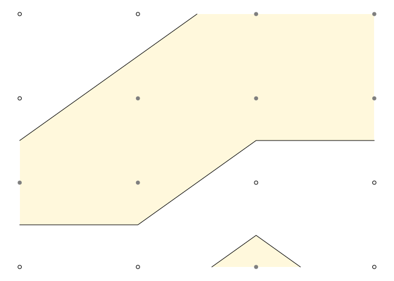

Isobands
================

The isoband package implements fast algorithms for generating isolines
(lines of equal elevation) and isobands (ranges of elevation delimited
by two isolines) from a matrix of elevation data. For both cases, the
package employs the marching squares algorithms as described on
[Wikipedia.](https://en.wikipedia.org/wiki/Marching_squares) Marching
squares algorithms break down the elevation matrix into blocks of 2x2
elevation values. For each block, they then determine the appropriate
isolines/isobands from a lookup table of all possible arrangements of
isolines or isobands within a 2x2 block. There are 16 distinct
possibilities for isolines and 81 for isobands. The implementation in
the isoband package goes beyond the algorithm described on Wikipedia in
that it merges the isolines or isobands from separate blocks into
extended line traces or polygons. The package is meant as a low-level
package with minimal required dependencies. Therefore, many of the
functions provided may not immediately be useful to endusers, but they
will enable developers of other packages to integrate isolines and
isobands into their feature set.

The two main functions of the package are called `isolines()` and
`isobands()`, and they have similar user interfaces and return values.
Both take a vector `x` specifying the x values corresponding to the
columns of the elevation matrix, a vector `y` specifying the y values
corresponding to the rows of the elevation matrix, and an elevation
matrix `z`. The two functions differ in that `isolines()` takes a single
argument `levels` specifying the elevation levels for which isolines
should be calculated, whereas `isobands()` takes two arguments,
`levels_low` and `levels_high`, specifying the lower and upper bounds
for each isoband. The return value in both cases is a list of lists. The
outer list contains one list element for each specified isolevel. The
inner lists hold line or polygon data in the form `x`, `y`, `id` as used
by `grid::polylineGrob()` or `grid::pathGrob()`. The format has been
chosen for easy drawing of the resulting values via these two grid
functions.

``` r
library(isoband)
library(grid)

m <- matrix(
  c(0, 0, 0, 0, 0,
    0, 1, 2, 1, 0,
    0, 1, 2, 0, 0,
    0, 1, 0, 1, 0,
    0, 0, 0, 0, 0),
  5, 5, byrow = TRUE
)

lines <- isolines(x = 1:ncol(m)/6, y = nrow(m):1/6, z = m, levels = 0.5)
lines
#> $`0.5`
#> $`0.5`$x
#>  [1] 0.6666667 0.5833333 0.5000000 0.4166667 0.3333333 0.2500000 0.2500000
#>  [8] 0.2500000 0.3333333 0.5000000 0.6666667 0.7500000 0.6666667 0.6250000
#> [15] 0.6666667 0.7500000 0.6666667
#> 
#> $`0.5`$y
#>  [1] 0.2500000 0.3333333 0.3750000 0.3333333 0.2500000 0.3333333 0.5000000
#>  [8] 0.6666667 0.7500000 0.7916667 0.7500000 0.6666667 0.5833333 0.5000000
#> [15] 0.4166667 0.3333333 0.2500000
#> 
#> $`0.5`$id
#>  [1] 1 1 1 1 1 1 1 1 1 1 1 1 1 1 1 1 1
#> 
#> 
#> attr(,"class")
#> [1] "isolines" "iso"
grid.newpage()
grid.draw(polylineGrob(lines[[1]]$x, lines[[1]]$y, lines[[1]]$id))
```

<!-- -->

``` r

bands <- isobands(x = 1:ncol(m)/6, y = nrow(m):1/6, z = m, levels_low = 0.5, levels_high = 1.5)
bands
#> $`0.5:1.5`
#> $`0.5:1.5`$x
#>  [1] 0.6666667 0.5833333 0.5000000 0.4166667 0.3333333 0.2500000 0.2500000
#>  [8] 0.2500000 0.3333333 0.5000000 0.6666667 0.7500000 0.6666667 0.6250000
#> [15] 0.6666667 0.7500000 0.5000000 0.5416667 0.5833333 0.5000000 0.4166667
#> [22] 0.4166667
#> 
#> $`0.5:1.5`$y
#>  [1] 0.2500000 0.3333333 0.3750000 0.3333333 0.2500000 0.3333333 0.5000000
#>  [8] 0.6666667 0.7500000 0.7916667 0.7500000 0.6666667 0.5833333 0.5000000
#> [15] 0.4166667 0.3333333 0.4583333 0.5000000 0.6666667 0.7083333 0.6666667
#> [22] 0.5000000
#> 
#> $`0.5:1.5`$id
#>  [1] 1 1 1 1 1 1 1 1 1 1 1 1 1 1 1 1 2 2 2 2 2 2
#> 
#> 
#> attr(,"class")
#> [1] "isobands" "iso"
grid.newpage()
grid.draw(pathGrob(bands[[1]]$x, bands[[1]]$y, bands[[1]]$id, gp = gpar(fill = "cornsilk")))
```

<!-- -->

A convenience function `plot_iso()` can be used to inspect a single
isoband and corresponding isolines for an elevation matrix. This
function is mostly meant for debugging and illustration purposes. It
draws a grid of matrix points colored by whether each point is below,
within, or above the isoband, as well as the isoband itself and the
enclosing isolines.

``` r
plot_iso(m, 0.5, 1.5)
```

<!-- -->

The isoband package handles `NA` values in the matrix by simply ignoring
the respective grid points.

``` r
m <- matrix(
  c(NA, NA, NA, 0, 0, 0,
    NA, NA, NA, 1, 1, 0,
     0,  0,  1, 1, 1, 0,
     0,  1,  1, 0, 0, 0,
     0,  0,  0, 1, 0, 0,
     0,  0,  0, 0, 0, 0),
  6, 6, byrow = TRUE
)
plot_iso(m, 0.5, 1.5)
```

<!-- -->

Isobands can contain holes, as shown above, and they can also consist of
multiple disconnected pieces.

``` r
m <- matrix(
  c(0, 0, 1, 1,
    0, 1, 1, 1,
    1, 1, 0, 0,
    0, 0, 0.8, 0),
  4, 4, byrow = TRUE
)
plot_iso(m, 0.5, 1.5)
```

<!-- -->

# Performance

The code is written in C++ and performance is generally good. Isolining
is about as fast as `grDevices::contourLines()`, isobanding is
approximately 2.5 times slower.

``` r
# contouring with contourLines() from grDevices
fn_contourLines <- function() {
  grDevices::contourLines(1:ncol(volcano), 1:nrow(volcano), volcano, levels = 10*(10:18))
}

# contouring with isolines()
fn_isolines <- function() {
  isolines(1:ncol(volcano), 1:nrow(volcano), volcano, 10*(10:18))
}

# contouring with isobands()
fn_isobands <- function() {
  isobands(1:ncol(volcano), 1:nrow(volcano), volcano, 10*(9:17), 10*(10:18))
}

microbenchmark::microbenchmark(fn_contourLines(), fn_isolines(), fn_isobands())
#> Unit: milliseconds
#>               expr      min       lq     mean   median       uq       max neval
#>  fn_contourLines() 1.563877 1.624452 2.330862 1.881795 2.677366  7.688460   100
#>      fn_isolines() 1.440533 1.482699 1.773548 1.567380 1.700452  4.695194   100
#>      fn_isobands() 3.967485 4.065956 4.983322 4.253281 4.588195 32.703629   100
```
